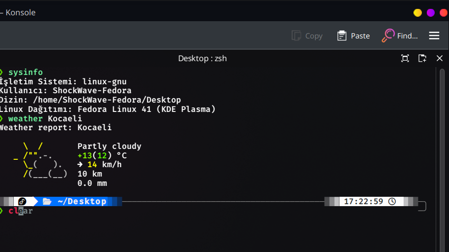

## Terminal101

#### Install ZSH
`sudo apt install zsh`
##### Set zsh as default
`chsh -s $(which zsh)`

##### zsh default themes
https://github.com/ohmyzsh/ohmyzsh/wiki/Themes

edit .zshrc

ZSH_THEME="jonathan"

##### Install ohmyzsh
`sh -c "$(curl -fsSL https://raw.githubusercontent.com/ohmyzsh/ohmyzsh/master/tools/install.sh)"`

##### Zsh Must-Have Plugin
`git clone https://github.com/zsh-users/zsh-autosuggestions.git $ZSH_CUSTOM/plugins/zsh-autosuggestions`

`git clone https://github.com/zsh-users/zsh-syntax-highlighting.git $ZSH_CUSTOM/plugins/zsh-syntax-highlighting`

edit .zshrc to include plugins
plugins=(git zsh-autosuggestions zsh-syntax-highlighting)

##### plugins include with ohmyzsh
https://github.com/ohmyzsh/ohmyzsh/wiki/Plugins


##### Nerd Font
https://www.nerdfonts.com/

https://github.com/ryanoasis/nerd-fonts/tree/master/patched-fonts/FiraMono

download and install firamono for linux

##### Install Powerlevel 10k
`git clone https://github.com/romkatv/powerlevel10k.git $ZSH_CUSTOM/themes/powerlevel10k`

edit .zshrc

ZSH_THEME="powerlevel10k/powerlevel10k"

POWERLEVEL9K_MODE="nerdfont-complete"

##### Functions

```bash
# IP
function myip() {
    curl ifconfig.me
}

# Weather
function weather() {
    if [ -z "$1" ]; then
        echo "Usage: weather <city>"
    else
        curl -s "wttr.in/$1?0"
    fi
}

# System
function sysinfo() {
    # OS
    echo "Operating System: $OSTYPE"
    
    # User
    echo "User: $(whoami)"
    
    # Directory
    echo "Directory: $(pwd)"
    
    # macOS
    if [[ "$OSTYPE" == "darwin"* ]]; then
        echo "macOS Version: $(sw_vers -productVersion)"
    
    # Linux
    elif [[ "$OSTYPE" == "linux-gnu"* ]]; then
        echo "Linux Distribution: $(lsb_release -d | cut -f2-)"
    fi
}

